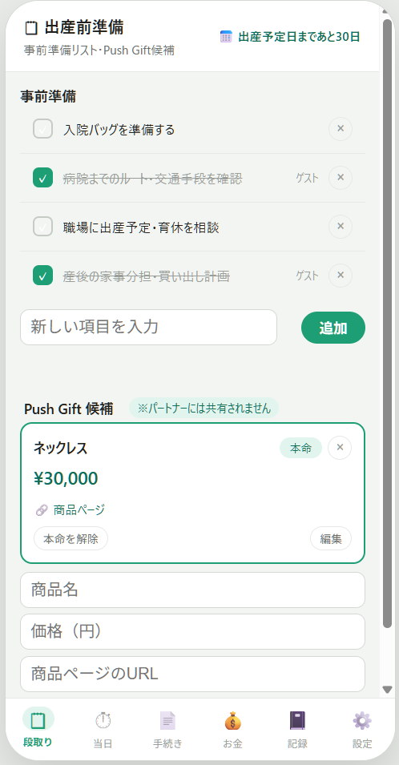
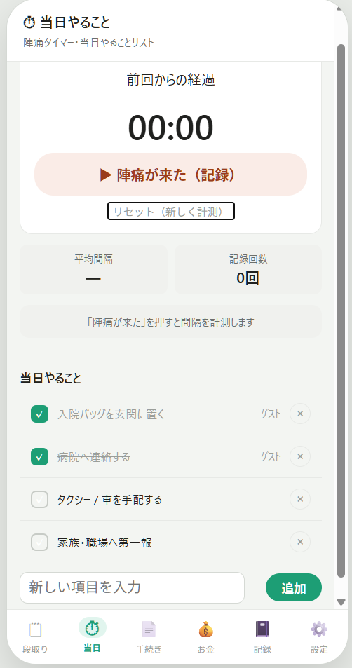
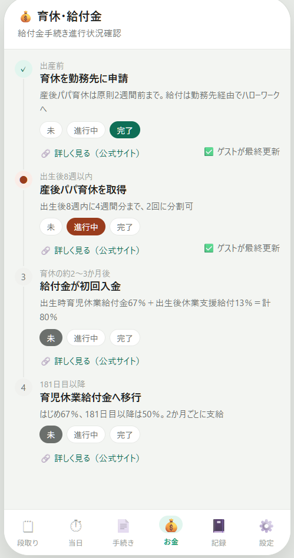
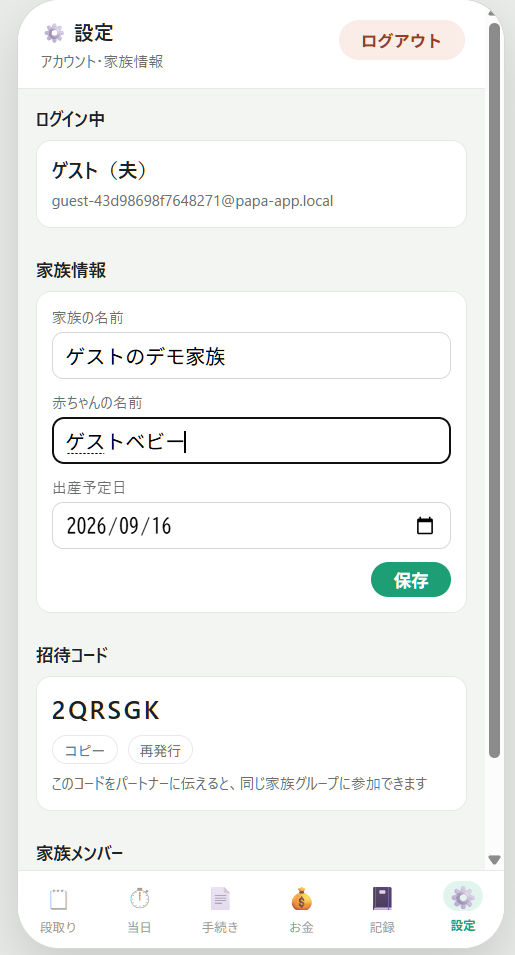
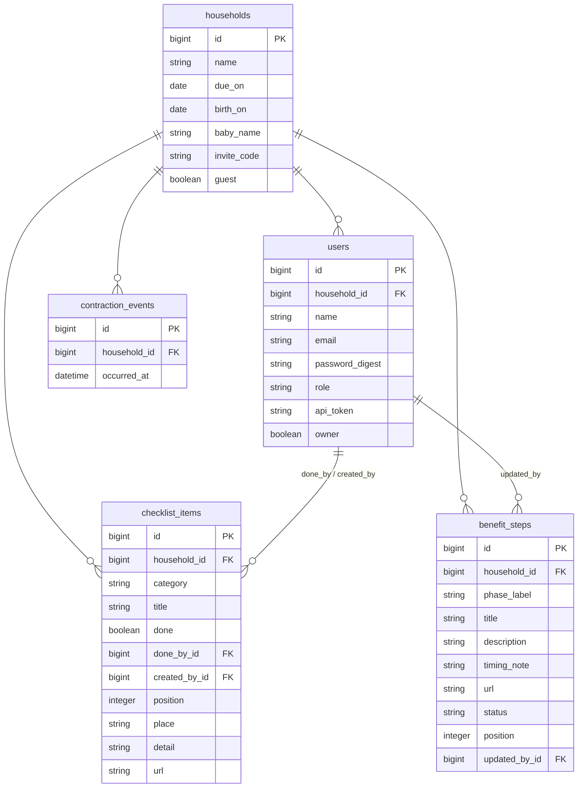

# 出産前後 パパアプリ（papa_app）

夫が「いつ・何をすべきか」で迷わないよう、出産前後の**段取り・当日対応・行政手続き・育休給付金・記録**を、夫婦二人三脚で管理できるアプリです。招待コードで同じ家族グループに入ると、お互いの操作(チェック済み・未完了)がリアルタイムに共有されます。

> 弟が父親になる中で、「何を・いつ・誰がやるか」が夫婦間で曖昧なまま出産を迎えることへの不安から着想しました。行政手続きの複雑さと、陣痛時のパニックの中でも迷わず動けることを重視して設計しています。

---

## 📌 デモ / 動作確認

- **デプロイURL**: （デプロイ後に記載）
- **ゲストログイン**: ログイン画面の「ゲストログイン」ボタンから、登録不要ですべての機能をお試しいただけます。押すたびに使い捨てのデモアカウント(サンプルデータ入り)が発行され、24時間後に自動で削除されます。

---

## 🖼 スクリーンショット

| 段取り・準備 | 当日(陣痛タイマー) |
| :---: | :---: |
|  |  |

| 育休・給付金 | 設定・家族招待 |
| :---: | :---: |
|  |  |

---

## ✨ 主な機能

### 段取り・準備
- 妊娠後期の事前準備チェックリスト(入力・完了トグル・削除)
- パートナーには共有されない非公開の「Push Gift候補」(欲しいものリスト)。商品名・価格・URLを登録し、価格は自動でカンマ区切り整形

### 当日対応
- 陣痛タイマー：「陣痛が来た」を押すたびに間隔を記録し、平均間隔・記録回数を自動集計。間隔が目安に近づくと「病院に電話」アラートを表示
- 当日やることチェックリスト

### 出産手続き
- 出生届・児童手当・出産育児一時金などの届出チェックリスト。提出先・補足・公式リンク付き

### 育休・給付金
- 産後パパ育休〜育児休業給付金の流れをタイムライン表示し、ステップごとに「未・進行中・完了」を管理

### 設定・家族共有
- 家族の名前・赤ちゃんの名前・出産予定日の編集
- 招待コードでパートナーを同じ家族グループに招待、メンバー一覧・削除、招待コードの再発行

### 認証・ゲストログイン
- `has_secure_token` によるBearerトークン認証
- 招待コードを使った家族単位のマルチユーザー(夫婦間共有)
- ゲストログイン：呼び出すたびに使い捨ての家族・ユーザーを生成し、初期データ入りで即座に試用可能。Coolifyのスケジュールタスクで毎日、作成から24時間経過したゲストデータを自動削除

---

## 🛠 使用技術

| 分類 | 技術 |
| --- | --- |
| 言語 | Ruby 3.3.3 / JavaScript |
| フレームワーク | Ruby on Rails 7.2.3(`ActionController::API`) |
| データベース | PostgreSQL |
| フロントエンド | HTML / CSS(独自実装)/ Vanilla JavaScript |
| 認証 | bcrypt(`has_secure_password`)＋ `has_secure_token` によるAPIトークン |
| インフラ | Docker(Rails標準Dockerfile)＋ [Coolify](https://coolify.io/)によるセルフホストデプロイ、Let's Encrypt(HTTPS) |
| バージョン管理 | Git / GitHub |

> フロントエンドはフレームワークを使わず、タブ切り替え・API通信・DOM描画をVanilla JavaScriptで実装しています。

---

## 🗄 ER図



| リレーション | 種類 | 説明 |
| --- | --- | --- |
| households → users | 1対多 | 1つの家族に夫婦(複数ユーザー)が所属 |
| households → checklist_items 等 | 1対多 | 家族が削除されると関連データも `dependent: :destroy` で連動削除 |
| users → checklist_items | 1対多(2経路) | 「誰が完了にしたか」「誰が作成したか」を別々の外部キーで保持 |

---

## 💡 実装上の工夫

### 家族単位のデータ共有とアクセス制御
招待コードを起点に、夫婦を同じ`Household`に紐づける設計にすることで、片方の操作(チェック完了・記録追加)がもう片方にもリアルタイムに反映される仕組みをシンプルなAPI設計で実現しました。

### 完了操作の誤操作防止
チェック済みの項目を未完了に戻す操作は、パートナーが完了させたものを誤って取り消さないよう確認ダイアログを挟み、かつ「誰が完了にしたか」を表示することで意図しない上書きを防いでいます。

### 陣痛タイマーの集計ロジック
記録のたびに平均間隔を再計算し、目安の間隔に近づいたら自動でアラート表示を切り替える設計にすることで、当日パニックになりがちな場面でも判断材料をシンプルに提示できるようにしました。

---

## 🔧 苦労した点と解決策

### ブラウザのセキュアコンテキスト制約でクリップボードコピーが動かない
本番動作確認をIPアドレス＋HTTPのLAN環境で行っていたところ、招待コードの「コピー」ボタンが反応しない問題が発生。調査の結果、`navigator.clipboard.writeText()` はHTTPSまたはlocalhostでしか動作しないブラウザの仕様(セキュアコンテキスト制限)が原因と判明。本番はHTTPSで運用するため実害はないと判断しつつ、開発時とテスト時でAPIの利用可否が変わる点を学びました。

### 新機能デプロイ後にコンテナが起動直後にクラッシュループ
ゲストログイン機能の追加後、デプロイは成功と表示されるのにコンテナがすぐ`Exited`になる問題が発生。CoolifyのUI上の実行ログはコンテナが停止すると閲覧できなくなる仕様だったため、SSHで直接サーバーに入り`docker logs`でエラーを確認したところ、Rubyのモデルファイル内でメソッド定義が重複し、`end`が1つ不足する構文エラーが原因でした。UI経由のログだけに頼らず、必要に応じてサーバーへ直接アクセスして生のログを見に行く判断の重要性を学びました。

### ゲストデータの肥大化とプライバシーの両立
当初は固定の共有デモアカウント方式を検討しましたが、複数人が同時にゲスト体験すると互いのデータが混在してしまう問題に気づき、ログインのたびに使い捨てアカウントを新規発行する方式に変更しました。一方でこの方式はDBにレコードが際限なく溜まり続けるトレードオフがあるため、Coolifyのスケジュールタスク機能で「作成から24時間経過したゲストデータを毎日自動削除するバッチ」を追加し、体験の質とDBの健全性を両立させました。


---

## 🚀 ローカル環境での起動

```bash
# リポジトリをクローン
git clone https://github.com/kazkaz9717/papa_app.git
cd papa_app

# 依存パッケージをインストール
bundle install

# データベースを作成・初期化
rails db:create
rails db:migrate

# サーバーを起動
rails server
```

ブラウザで `http://localhost:3000` にアクセスし、ゲストログインからお試しください。

---

## 👤 制作者

- GitHub: [kazkaz9717](https://github.com/kazkaz9717)